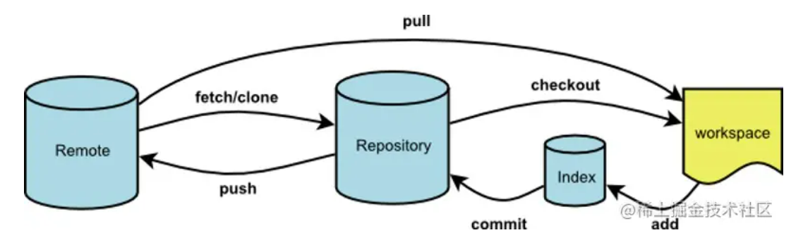

### 参考连接：
### author：鼓风机
### time：2022年6月8日

## 1、git相关知识
git是一个C语言写的分布式版本控制系统。其工作区域和流程如下：

如图一共有四个工作区：
（1）remote：远程仓库，也就是我们git上面打项目代码仓库，是用来托管代码的服务器。
（2）repository：本地仓库，位于自己的电脑上，通过git commit提交暂存区的内容才会进入本地仓库
（3）index：暂存区，当执行git add 的命令时，工作区的文件就会被移入暂存区，暂存区标记了当前工作中哪些内容是被git管理的，当完成某个需求或者功能后需要提交代码，第一步就是通过git add 先提交到暂存区
（4）workspace：工作区，进行开发改动的地区，即开发人员看到的最新的内容，开发时是对工作区的内容进行改动

## 2、git安装和vscode配置git

## 3、git基本操作命令

## 4、多人合作项目开发git提交规范

